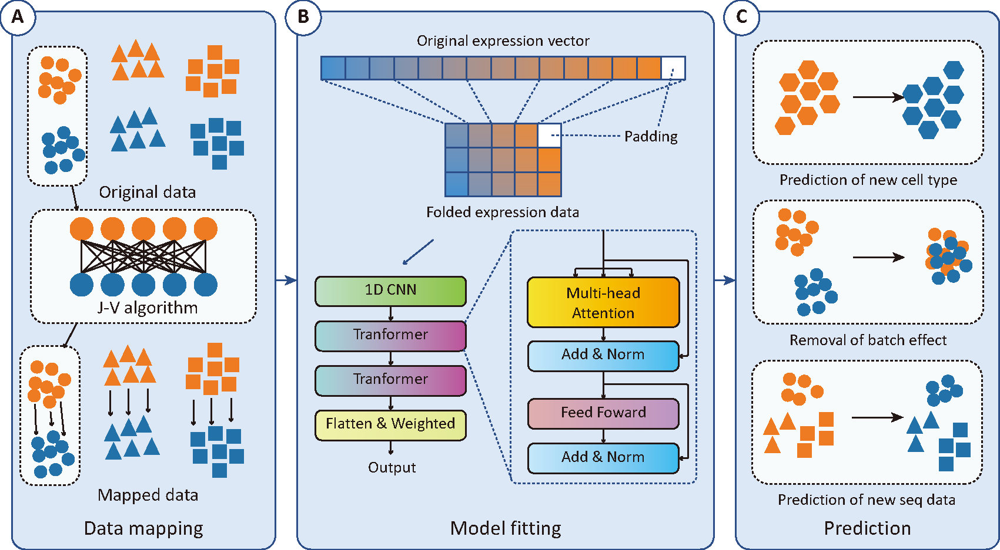

# scPert


[](https://pubmed.ncbi.nlm.nih.gov/)


## intallment
scPert is developed with PyTorch. To use it, please install requirements first.

```bash
git clone https://github.com/GCS-ZHN/scPert.git
cd scPert
conda create -n scpert python=3.8
conda activate scpert
pip install -r requirements.txt
```

## usage
```bash
python -m scPert
```